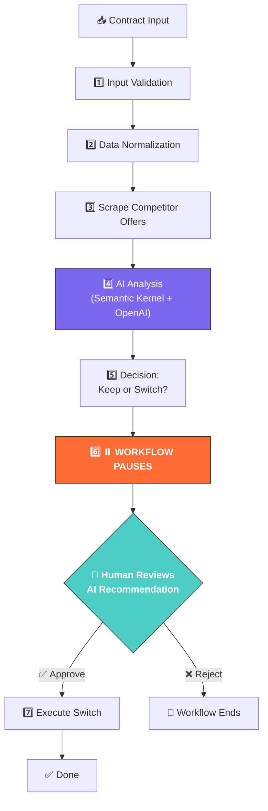

# LinkedIn Post Diagram - Human-in-the-Loop
# Copy the code below and paste it at https://mermaid.live to generate the image

```mermaid
flowchart TD
    A["📥 Contract Input"] --> B["1️⃣ Input Validation"]
    B --> C["2️⃣ Data Normalization"]
    C --> D["3️⃣ Scrape Competitor Offers"]
    D --> E["4️⃣ AI Analysis\n(Semantic Kernel + OpenAI)"]
    E --> F["5️⃣ Decision:\nKeep or Switch?"]
    
    F --> G["6️⃣ ⏸️ WORKFLOW PAUSES"]
    
    G --> H{"👤 Human Reviews\nAI Recommendation"}
    
    H -->|"✅ Approve"| I["7️⃣ Execute Switch"]
    H -->|"❌ Reject"| J["🛑 Workflow Ends"]
    
    I --> K["✅ Done"]

    style G fill:#FF6B35,stroke:#333,color:#fff,font-weight:bold
    style H fill:#4ECDC4,stroke:#333,color:#fff,font-weight:bold
    style E fill:#7B68EE,stroke:#333,color:#fff
```
